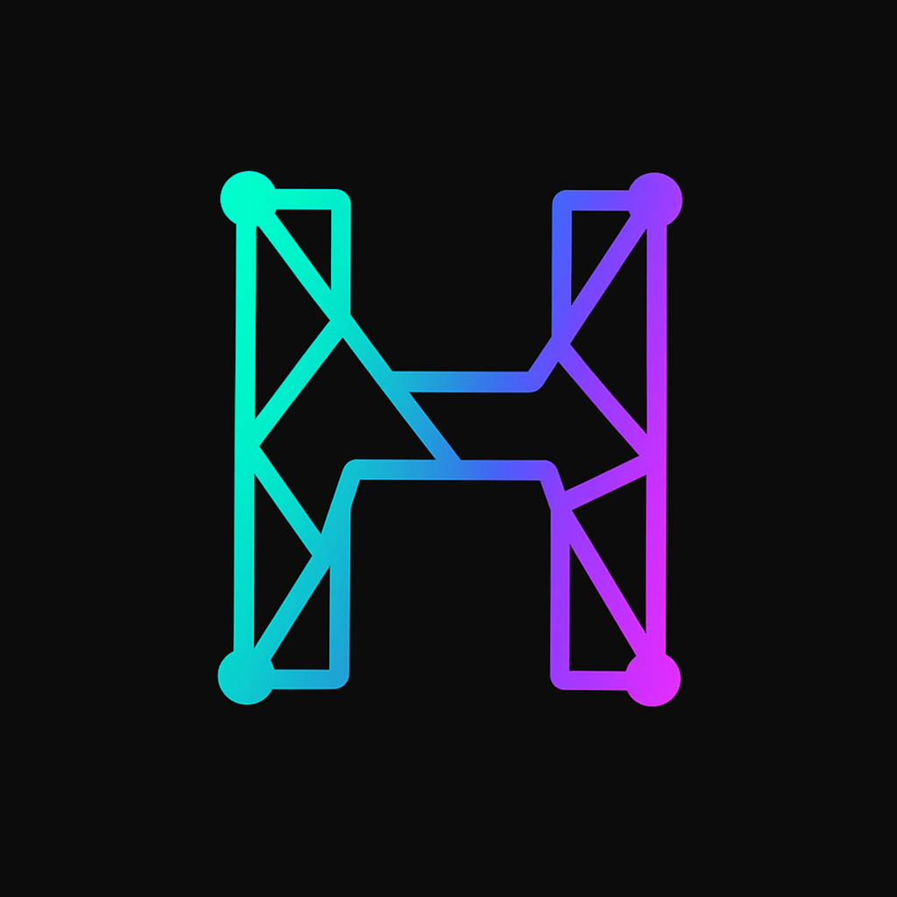

#  HUB Portal - Multi-Chain Social Chat Platform

**HUB Portal** is a revolutionary Web3 social platform that combines real-time chat with comprehensive token rewards across multiple blockchain networks. Experience seamless wallet integration, beautiful design, and true digital ownership through innovative subscription, staking, and NFT bonus systems.

---

## 🧾 Smart Contracts Overview

| Network | Purpose | Contract | Address |
|--------|----------|----------|----------|
| **Base** | HUB Token Mining | HUB Ecosystem Token | [`0x58EFDe38eF2B12392BFB3dc4E503493C46636B3E`](https://basescan.org/address/0x58EFDe38eF2B12392BFB3dc4E503493C46636B3E) |
| **Base** | HUB Chat Rewards | Tiered Mining System | [`0x8ea3818294887376673e4e64fBd518598e3a2306`](https://basescan.org/address/0x8ea3818294887376673e4e64fBd518598e3a2306) |
| **Base** | Daily GM USDC Streak | Daily GM USDC Streak System | [`0x220160fad5f6f5c2Af2674469dD99e132759D9Ca`](https://basescan.org/address/0x220160fad5f6f5c2Af2674469dD99e132759D9Ca) |
| **Base** | HUB Staking | Multi-Tier Staking 3/6/12M | [`0xd4ca2b40cEAEC7006Fa38c3Bb07ceD449b9bF7DB`](https://basescan.org/address/0xd4ca2b40cEAEC7006Fa38c3Bb07ceD449b9bF7DB) |
| **Base** | Genesis NFT | HUB Ecosystem Genesis NFT | [`0xdAf7B15f939F6a8faf87d338010867883AAB366a`](https://basescan.org/address/0xdAf7B15f939F6a8faf87d338010867883AAB366a) |
| **Celo** | HC Token Mining | HelloCelo ERC20 | [`0x12b6e1f30cb714e8129F6101a7825a910a9982F2`](https://celoscan.io/token/0x12b6e1f30cb714e8129F6101a7825a910a9982F2) |
| **Celo** | Daily GM CELO Streak | Daily GM CELO Streak System | [`0x5A2652Db9D2eb49C9c66f1952DD56ECd8ED915bc`](https://celoscan.io/address/0x5A2652Db9D2eb49C9c66f1952DD56ECd8ED915bc) |
| **Linea** | LPX Token Mining | Linea Prime Token | [`0x668F584d27Ce86149d6162a94D0BCd3C643Cb525`](https://lineascan.build/address/0x668F584d27Ce86149d6162a94D0BCd3C643Cb525) |
| **Linea** | Daily GM mUSD Streak | Daily GM mUSD Streak System | [`0x4e4F31986aB5eCf851F5a5321eE83C501cd1D4a8`](https://lineascan.build/address/0x4e4F31986aB5eCf851F5a5321eE83C501cd1D4a8) |
| **Polygon** | MSG Token Mining | Message Protocol Token | [`0x139E53FC21f5B95e88dA8Ef9Da57cA5d143f2163`](https://polygonscan.com/address/0x139E53FC21f5B95e88dA8Ef9Da57cA5d143f2163) |
| **Polygon** | Daily GM POL Streak | Daily GM POL Streak System | [`0x12F9003d35e30D6Cec22C3E618CE4d4Cd87F8444`](https://polygonscan.com/address/0x12F9003d35e30D6Cec22C3E618CE4d4Cd87F8444) |
| **Soneium** | LUM Token Mining | LUM Token Mining | [`0x775AD8230648CA3E9C02687A21C69BECC54868Ad`](https://soneium.blockscout.com/address/0x775AD8230648CA3E9C02687A21C69BECC54868Ad) |
| **Soneium** | Daily GM ASTR Streak | Daily GM ASTR Streak System | [`0x91f586f33Ee6582d307E06fd0dca31a4De079B1E`](https://soneium.blockscout.com/address/0x91f586f33Ee6582d307E06fd0dca31a4De079B1E) |
| **Arbitrum** | ARBX Token Mining | Portal Token (ARBX) | [`0xe89F9D96f059D656d62302c30fD513C945aCcF38`](https://arbiscan.io/address/0xe89F9D96f059D656d62302c30fD513C945aCcF38) |
| **Arbitrum** | Daily GM ARB Streak | Daily GM ARB Streak System | [`0x8E0A9B35306ce9Ddf7ea7BD3cc4E2D266186a4ED`](https://arbiscan.io/address/0x8E0A9B35306ce9Ddf7ea7BD3cc4E2D266186a4ED) |
| **Monad** | HUBBY Token Mining | HUBBY Token Mining for Chat | [`0xD3f1028629d56B29a503c1a1f98A2112Dad18d9e`](https://monad.blockscout.com/address/0xD3f1028629d56B29a503c1a1f98A2112Dad18d9e) |
| **Monad** | HUBBY Token Trading | HUBBY Token on Nad.fun | [`0x116d5cd7dD3108FC76084B4511D362B50d447777`](https://nad.fun/tokens/0x116d5cd7dD3108FC76084B4511D362B50d447777) |
| **Monad** | HUBBY NFT Collection | HUBBY NFT on OpenSea | [`0xf66af9dc317ec514ebc8b64544db2983f768a560`](https://opensea.io/collection/hubbit-hero) |

---

## ✨ Features

### 💬 Intelligent Multi-Chain Messaging
- **Public Chat** - Community conversations with instant delivery across all devices
- **Real-time Synchronization** - Messages appear instantly for all users
- **Multi-Chain Rewards** - Earn native tokens on Base, Celo, Linea, Polygon, Soneium, Arbitrum, and Monad networks
- **Admin Tools** - Message moderation and embedded content for administrators
- **User Profiles** - Custom avatars, nicknames, and on-chain statistics
- **Cross-Chain Experience** - Seamlessly switch between different blockchain networks

### 🎁 Advanced Token Reward System

| Network | Token | Features | Daily Limit |
|---------|-------|----------|-------------|
| **Base** | HUB | Tiered subscription system (FREE/BASIC/PREMIUM) | 10-∞ messages |
| **Celo** | HC | Classic mining with 1 HC per message | 10 messages |
| **Linea** | LPX | Anti-spam protection & admin controls | 100 messages |
| **Polygon** | MSG | Gas-optimized messages & full statistics | 100 messages |
| **Soneium** | LUM | Daily rewards with message protocol | 100 messages |
| **Arbitrum** | ARBX | Portal Token mining on Layer 2 | 100 messages |
| **Monad** | HUBBY | Native token mining on Monad network | 100 messages |

### 🔥 Daily GM Streak System

Maintain daily streaks across all networks:
- **Base**: GM with USDC fee
- **Celo**: GM with CELO fee  
- **Linea**: GM with mUSD fee
- **Polygon**: GM with POL (MATIC) fee
- **Soneium**: GM with ASTR fee
- **Arbitrum**: GM with ARB fee
- **Monad**: GM with MON fee

**How it works:**
1. Send your daily GM to keep your streak alive
2. Streak continues if you GM within 24h window
3. Miss 24h? Your streak resets to 1
4. Longer streak = bigger rewards!

### 🌟 Soneium Score System

Track your activity with the unique Soneium Score:
- **Score Calculation**: Based on messages sent, GM streaks, and engagement
- **Leaderboard**: Compete with other users on the network
- **Badges**: Earn special badges for reaching score milestones
- **Benefits**: Higher scores unlock exclusive features and rewards

### 🏦 HUB Staking & Badge System

Lock HUB tokens to earn rewards and exclusive badges:

| Lock Period | APR | Badge | Future Airdrop Multiplier |
|-------------|-----|-------|---------------------------|
| 3 Months | 3% | - | - |
| 6 Months | 5% | - | - |
| 12 Months | 9% | 🥉 Bronze (20k HUB) | x3 |
| 12 Months | 9% | 🥈 Silver (50k HUB) | x10 |
| 12 Months | 9% | 🥇 Gold (100k HUB) | x20 |

### 🎭 Genesis NFT Collection

**HUB Ecosystem Genesis NFT Benefits:**
- 10x daily USDC rewards (0.11 vs 0.01)
- Priority access to new features
- Future ecosystem airdrop multipliers
- VIP Discord roles
- Special profile badges

### 🌀 Monad Network - HUBBY Ecosystem

**HUBBY Token Features:**
- **Token Name**: HUBBY
- **Symbol**: HUBBY
- **Contract**: `0xD3f1028629d56B29a503c1a1f98A2112Dad18d9e`
- **Reward per Message**: 1 HUBBY
- **Daily Limit**: 100 messages
- **Trading**: Available on [Nad.fun](https://nad.fun/tokens/0x116d5cd7dD3108FC76084B4511D362B50d447777)

**HUBBY NFT Collection:**
- **Collection**: Hubbit Hero
- **Contract**: `0xf66af9dc317ec514ebc8b64544db2983f768a560`
- **Platform**: [OpenSea](https://opensea.io/collection/hubbit-hero)
- **Features**: Unique NFT avatars with special benefits

**Monad Network Advantages:**
- ⚡ **High Performance**: Ultra-fast transaction processing
- 💰 **Low Fees**: Cost-effective transactions on Monad L1
- 🎨 **HUBBY NFTs**: Exclusive NFT collection with special perks
- 💬 **HUBBY Chat**: Dedicated Telegram community for Monad users
- 🛒 **Easy Trading**: Buy HUBBY directly from Nad.fun platform

---

## 🚀 Getting Started

### Quick Start
1. **Connect Wallet**: Use your preferred Web3 wallet (MetaMask, Rabby, etc.)
2. **Choose Network**: Switch to Base, Celo, Linea, Polygon, Soneium, Arbitrum, or Monad
3. **Set Profile**: Choose nickname and avatar
4. **Start Chatting**: Send messages to earn tokens
5. **Maintain Streak**: Send daily GM to keep your streak alive

### Network-Specific Features

**Base Network**:
- Tiered subscription system (FREE/BASIC/PREMIUM)
- HUB token mining (1 HUB per message)
- Staking with 3/6/12 month lock periods
- Genesis NFT bonus system

**Celo Network**:
- Classic HC token mining (1 HC per message)
- Daily GM streak with CELO fees
- Simple 10 messages daily limit

**Linea Network**:
- LPX token mining with anti-spam protection
- 100 messages daily limit
- Comprehensive admin controls

**Polygon Network**:
- MSG token mining with gas optimization
- Choice between full or light messages
- Full on-chain statistics

**Soneium Network**:
- LUM token mining with message protocol
- 100 messages daily limit
- Soneium Score system with leaderboard
- Daily GM streak with ASTR fees

**Arbitrum Network**:
- ARBX Portal Token mining (1 ARBX per message)
- Ultra-low transaction fees (Layer 2)
- 100 messages daily limit
- Daily GM streak with ARB fees
- Integration with Arbitrum DeFi ecosystem

**Monad Network**:
- HUBBY token mining (1 HUBBY per message)
- High-performance L1 blockchain
- 100 messages daily limit
- Exclusive HUBBY NFT collection
- HUBBY trading on Nad.fun platform
- Dedicated Telegram community
- MON native token donations

---

## 💎 Token Ecosystems

### Base Network - HUB Token
- **Name**: HUB Ecosystem
- **Symbol**: HUB
- **Total Supply**: 10,000,000,000 HUB
- **Utility**: Chat rewards, subscriptions, staking, governance
- **Contract**: `0x58EFDe38eF2B12392BFB3dc4E503493C46636B3E`

### Celo Network - HC Token  
- **Supply**: 1,000,000 HC
- **Utility**: Chat mining and CELO streak access
- **Requirement**: 200 HC needed for CELO streaks

### Linea Network - LPX Token
- **Name**: Linea Prime
- **Symbol**: LPX
- **Total Supply**: 1,000,000,000 LPX
- **Utility**: Linea network chat rewards with anti-spam protection

### Polygon Network - MSG Token
- **Name**: Message Protocol
- **Symbol**: MSG
- **Total Supply**: 1,000,000,000 MSG
- **Reward per Message**: 1 MSG
- **Utility**: Advanced chat rewards with gas optimization

### Soneium Network - LUM Token
- **Name**: LUM Token
- **Symbol**: LUM
- **Utility**: Daily mining rewards with message protocol
- **Features**: 100 messages daily limit, on-chain statistics

### Arbitrum Network - ARBX Token
- **Name**: Portal Token
- **Symbol**: ARBX
- **Contract**: `0xe89F9D96f059D656d62302c30fD513C945aCcF38`
- **Utility**: Chat mining rewards on Arbitrum Layer 2
- **Features**: 100 messages daily limit, ultra-low fees, DeFi integration
- **Reward per Message**: 1 ARBX

### Monad Network - HUBBY Token
- **Name**: HUBBY Token
- **Symbol**: HUBBY
- **Contract**: `0xD3f1028629d56B29a503c1a1f98A2112Dad18d9e`
- **Total Supply**: To be announced
- **Utility**: Chat mining rewards on Monad network
- **Features**: 100 messages daily limit, exclusive NFT collection
- **Trading**: Available on [Nad.fun](https://nad.fun/tokens/0x116d5cd7dD3108FC76084B4511D362B50d447777)
- **NFT Collection**: [Hubbit Hero on OpenSea](https://opensea.io/collection/hubbit-hero)

---

## 🎯 Monad Network Quick Links
- **🌐 Website**: [Monad Network](https://www.monad.xyz/)
- **💬 HUBBY Telegram**: [Join Chat](https://t.me/+_Q1A-dW002c5MjFk)
- **🛒 Buy HUBBY**: [Nad.fun](https://nad.fun/tokens/0x116d5cd7dD3108FC76084B4511D362B50d447777)
- **🎨 HUBBY NFTs**: [OpenSea Collection](https://opensea.io/collection/hubbit-hero)
- **🔍 Explorer**: [Monad Blockscout](https://monad.blockscout.com/)

---

## 🌐 HUB Ecosystem Integration

HUB Portal is the flagship social application within the **HUB Ecosystem**:
- Multi-chain identity across 7 networks
- NFT-integrated rewards system
- Governance-ready architecture
- Growing suite of dApps
- Future DeFi and voting modules

[🌐 Visit HUB Ecosystem](https://hubecosystem.xyz/)

---

## 🚀 Live Applications
- **Main Application**: https://hub-portal-chat.vercel.app  
- **Farcaster Mini App**: https://farcaster.xyz/miniapps/7USxyPewQ2B8/hub-chat  

---

## 📄 License
MIT License

---

**Building the Future of Social Web3** • **HUB Ecosystem** • **© 2025 Mysticpol**

